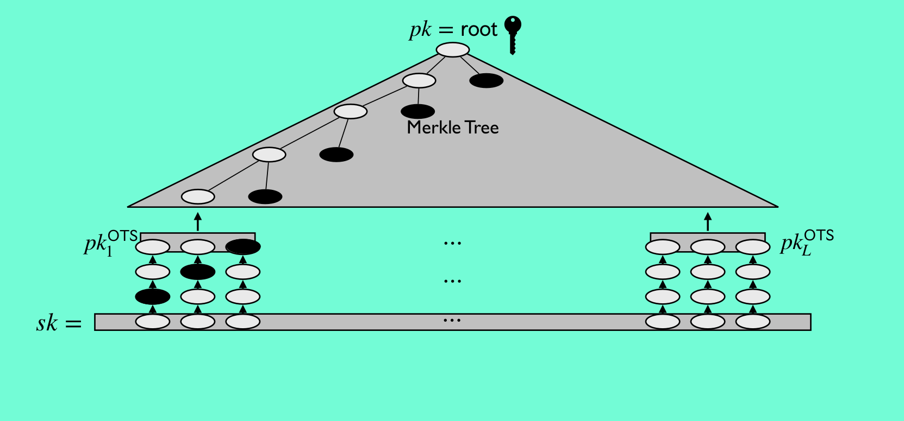

# hash-sigz

Resources
 - [Hash-Based Multi-Signatures for Post-Quantum Ethereum - Benedikt Wagner, Ethereum Foundation](./resources/hashsig.pdf)
 - [Rust reference implementation](https://github.com/b-wagn/hash-sig)
